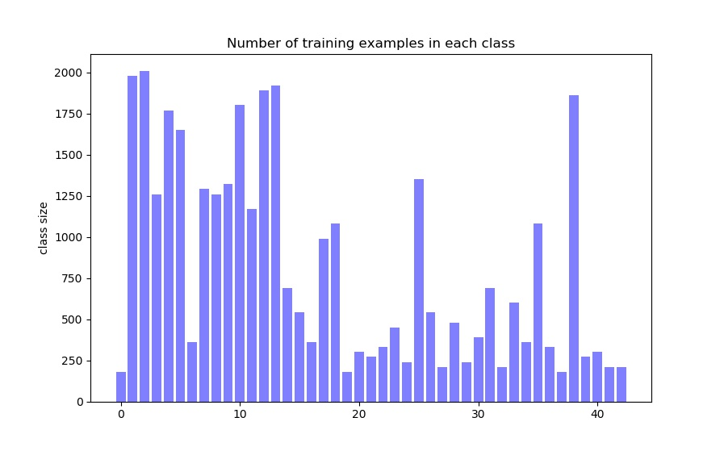
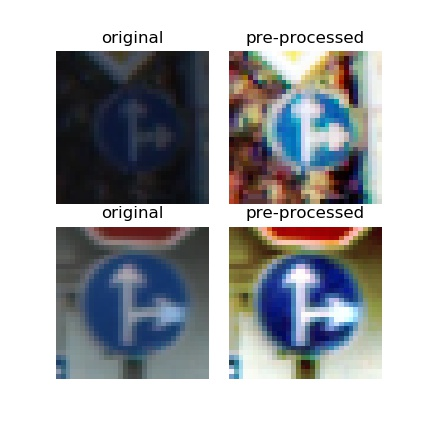
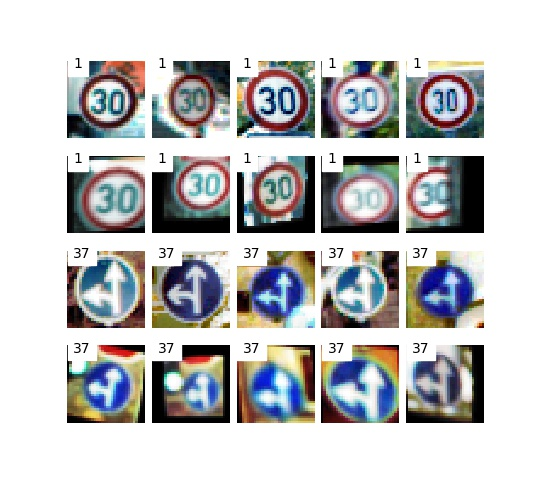
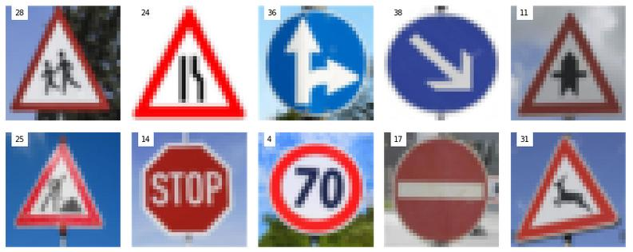

# Traffic Sign Recognition

**Build a Traffic Sign Recognition Project**

The goals / steps of this project are the following:

* Load the data set (see below for links to the project data set)
* Explore, summarize and visualize the data set
* Design, train and test a model architecture
* Use the model to make predictions on new images
* Analyze the softmax probabilities of the new images
* Summarize the results with a written report

## Rubric Points

**Here I will consider the [rubric points](https://review.udacity.com/#!/rubrics/481/view) individually and describe how I addressed each point in my implementation.**

### Link to my [project code](https://github.com/mwusdv/CarND-Traffic-Sign-Classifier-Project)

### Data Set Summary & Exploration
**1. Basic summary of the data set.**

I used the numpy library to calculate summary statistics of the traffic signs data set:

* The size of training set is ?  34799
* The size of the validation set is ? 4410
* The size of test set is ? 12630
* The shape of a traffic sign image is ? (32, 32, 3)
* The number of unique classes/labels in the data set is ? 43

**2. Exploratory visualization of the dataset.**

Here is an exploratory visualization of the data set. It is a bar chart showing how the data ...



### Design and Test a Model Architecture
**1. Pre-processing and data augmentation**

* **Histogram equalization.** The first step of pre-processing is histogram equalization. This is to reduce the impacts from the different intensity distributions in each image.  Here is an example of a traffic sign image before and after histogram equalization. We can see that the two original images have quite different intensity distributions. And this difference is reduced after histogram equalization.

    

* **Normalization.** As the second step of pre-processing: each image is normlaized by subtracting the mean and dividing by the standard deviation of that image. This can make the each image have the mean value of 0.0 and standard deviation of 1.0. By making the distribution of the images similar to each other, the training and generalization could be easier.

* **Generating more training examples.** Next I decided to generate additional data because as can be seen from the above bar chart, the number of training examples are highly imbalanced. And also the size, position, and angles vary a lot within the same classs. Therefore, 
    
    * I generated many training images to make the number of training examples equal to each other in different classes.

    * I used `cv2.warpAffine` to generate augmented images. Namely, an original traiing image was randomly selcted. Then it was transformed by rotation, translation, scaling and shearing. The rotation angle, translation amount, scaling amount and shearing parameters are randomly selected within the pre-defined ranges. Here is an example of some original images and some generated image. The first and the 3rd rows are the images from the original training data. While the 2nd and the 4th rows are the augmented images. It can be seen that the augmented images have rotaions, translations, scaling and shearing.

        
    
   
2. **Model architecture.**

     My final model architecture can be best described by the parameters in my code. I designed this format of parameters, because it gave me much flexibility to implement the network. I was able to experiment different network architectures, including the different number of layers with different parameters, by just chaning the parmaeters without changing the code itself.

    ```
    # pre-processing layers
    pre_prop_layers = [{'kernel': [3, 8], 
    'keep_prob': 1.0, 'go_to_fc': False, 
    'activation_fn': tf.nn.relu, 'padding': 'SAME', 
    'batch_norm': True, 'l2_reg': 0.01},
                            
    {'kernel': [1, 8],
    'keep_prob': 0.8, ' go_to_fc': False, 
    'activation_fn': tf.nn.relu, 'padding': 'SAME', 
    'batch_norm': True, 'l2_reg': 0.01}]


    # conv layers: 
    conv_layers = [{'kernel': [[3, 16], [5, 16], [7, 3, 16], [3, 7, 16]], 'pooling': True, 'keep_prob': 0.8, 
    'go_to_fc': True, 'activation_fn': tf.nn.relu, 'padding': 'SAME', 'batch_norm': True, 'l2_reg': 0.01},
        
    {'kernel': [[3, 32], [5, 32], [7, 3, 32], [3, 7, 32]], 
    'pooling': True, 'keep_prob': 1.0, 
    'go_to_fc': True, 'activation_fn': tf.nn.relu, 'padding': 'SAME', 'batch_norm': True, 'l2_reg': 0.01},

    {'kernel': [[3, 64], [5, 2, 64], [2, 5, 64]], 
    'pooling': True, 'keep_prob': 1.0,       
    'go_to_fc': True, 'activation_fn': tf.nn.relu, 'padding': 'SAME', 'batch_norm': True, 'l2_reg': 0.01}]


    # fully connected layers
    self._fc_layers = [{'hidden_dim': 512, 'keep_prob': 0.5, 
    'activation_fn': tf.nn.relu, 'batch_norm': True, 'l2_reg': 0.1}]
    ```
    In the above code block, the meaning of most of the parameters are quite straight forward. The meaning of the _kernel_ parameters will be described in the following.

    There are three blocks of layers in my model. 
    * The first block consists of **pre-processing** layers. I didn't do grayscaling in the previous pre-processing step. Rather I choosed to do the _pixel combinations_ here and let the algorithm to choose the optimal weights.  In this block, the _kernel_ parameters consists of two integer values. The first one is the size of the convolutional kernel, while the second one is the number of kernels.

    * The second block is made up of 3 convolutional and max-pooling layers. Here I choosed to use several kernels with different sizes within each layer. We can see that in each convolutional layer, the _kernel_ parmameter is a list, each element of which is either a two dimentional or three dimensional array. For two dimensional arrays, the first value is the size of the kernel, while the second value is the number of kernels with that size. For three dimensional arrays, the first two values define the size of the kernel, and the 3rd value is the number of kernels. Namely, in addition to use square shaped kernels, I also added some rectangular shaped kernels, trying to catch information with direction bias. The outpout of all the kernels were stacked together and feeded into the next steps.

    * The last block is just one fully connected layer.

    For regularization, I used l2-regularizer in each layer. Plus, I used dropout in the intial pre-processing, the first convolutional layers, and the fully connected layer. These are either close to the input images, or close to the final classification decision step.
	
	
3. **Trainging.** During training, I used RMPSPropOptimizer, with a learning rate of 0.001. The batch size was set to 512, and the number of epochs was 50.

    
4. In order to let the model _see_ more training examples, I re-generated the augmented training data every 5 epochs. This resulted in accuracy loss first on the validation set. But when I added **batch normalization** in each layer, the result was stablized and got improved. 

5. I trained the network for 50 epochs. In each epoch, the accuracy on the validation set was computed. And the network that corresponds to the best validation accuracy was saved as the final model. Then this model was applied on the test data.

6. My final model results were:

    * training set accuracy of: 99.997%
    * validation set accuracy: 99.682%
    * test set accuracy:  98.622%


7. The Googlenet is a well known architecture where kenerls with different sizes are applied in the same convolutional layers. Here I just borrowed this idea of combining the the kernels with different sizes and implemented and my network, which however has a much less complicated design than the Googlenet.

   
### Test a Model on New Images
1. I downloaded 10 German traffic sign images from web. Then I resized each of them to be 32*32. Here are these 10 images with their class labels printed on each of them.
 
The first and the eighth (class 4) images have some backgournds, and the last one has some rotations and shearing. So it might not be easy to classify them. 

2. However, as can be seen in the 14th cell of my project ipython notebook, my model classifed all these 10 images correctly. 

3. To check how certain the model is when predicting on each of the 10 new images, we can look at the softmax probabilities for each prediction. Here the top 3 softmax probabilities for each image along with the sign classes of each probability provided.

    The code for making predictions and calculating the top softmax probabilities are located in the 14th and the 15th cells of the Ipython notebook respectively.
    ```
      ([[9.9995220e-01, 4.7800560e-05, 2.3342344e-09],
       [1.0000000e+00, 6.6465400e-30, 2.5344827e-36],
       [1.0000000e+00, 0.0000000e+00, 0.0000000e+00],
       [9.9999964e-01, 3.4313572e-07, 2.7760066e-10],
       [1.0000000e+00, 0.0000000e+00, 0.0000000e+00],
       [1.0000000e+00, 0.0000000e+00, 0.0000000e+00],
       [1.0000000e+00, 0.0000000e+00, 0.0000000e+00],
       [1.0000000e+00, 1.1023785e-36, 0.0000000e+00],
       [1.0000000e+00, 0.0000000e+00, 0.0000000e+00],
       [1.0000000e+00, 1.0230324e-20, 7.4287592e-24]], dtype=float32),
        indices=array([
       [28, 24, 30],
       [24, 35, 18],
       [36,  0,  1],
       [38, 34, 40],
       [11,  0,  1],
       [25,  0,  1],
       [14,  0,  1],
       [ 4,  0,  1],
       [17,  0,  1],
       [31, 17, 25]], dtype=int32))
     
     Labels:  [28 24 36 38 11 25 14  4 17 31]
    ```
    From the above numbers, it can be seen that the model can correctly classify these 10 images with very high certainties.